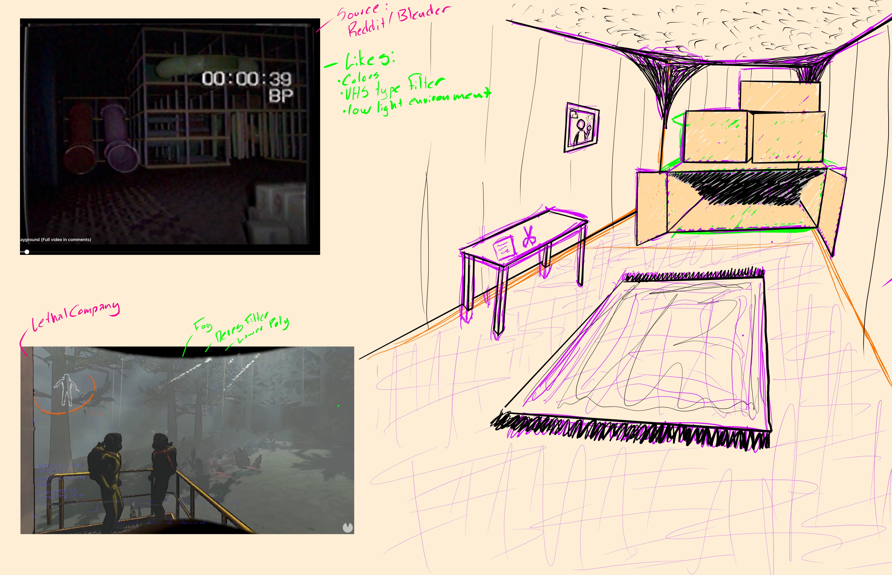

Project Cardboard

Overview:
    Based on a typical FPS horror game this will center around a cardboard fort and the contents within. The is to be extremely stylized as the environment will be created to emulate the inside of an elaburate fort, consisting of cardboard elements. With a goal of also applying a filter of sorts to emulate VHS or a sort of lower resolution effect. Ammo will also be extremely limited and will consist of potatos found around the fort and weapons that would be able to fire such ammuniton. 

Pitch:
    You find yourself trapped inside the worlds creepiest Cardboard Fort, armed with a slingshot and what little Russet Potatos you find growing within, Can you save your friend?

